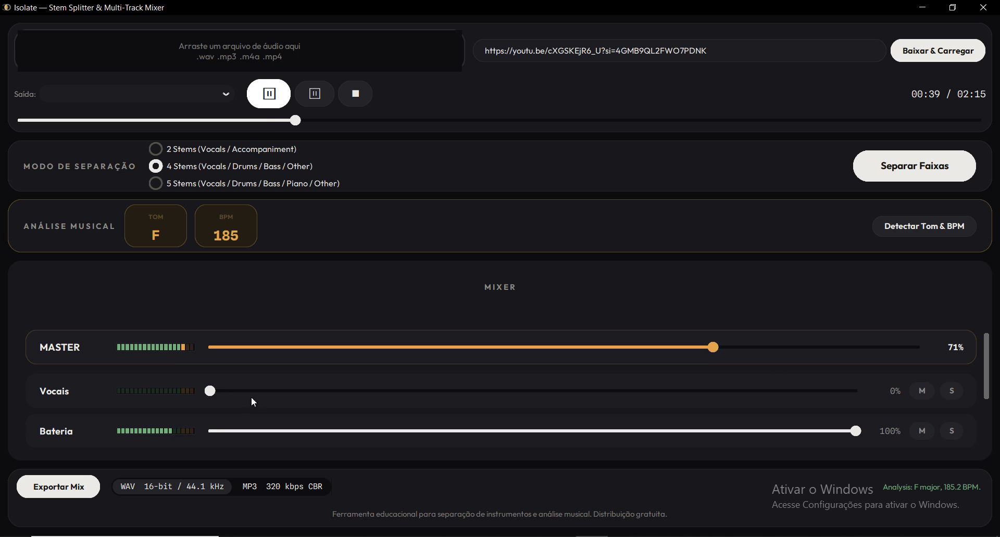

# Isolate — Stem Splitter & Multi-Track Mixer

**🇧🇷 Português** · [🇺🇸 English](#-english)

App desktop para Windows 10/11, **100% local e gratuito**, que separa uma
música em stems (vocais, bateria, baixo, piano, outros) e abre tudo num
mixer multi-track estilo DAW, com playback sincronizado em tempo real,
detecção automática de tom e BPM, e export do seu mix. Interface em
**português e inglês** (seletor PT/EN no rodapé).



## Recursos

- **Separação de stems** com [Spleeter](https://github.com/deezer/spleeter)
  (Deezer): 2, 4 ou 5 stems, modelos de alta fidelidade (16 kHz).
- **Mixer multi-track**: fader de ganho, mute e solo por stem, canal MASTER,
  VU meters LED com peak-hold — tudo em tempo real, sample-accurate.
- **Análise musical**: tom (perfis de Krumhansl-Kessler) e BPM
  (autocorrelação de spectral flux) detectados automaticamente, em NumPy puro.
- **Entrada flexível**: arraste um arquivo (`.wav .mp3 .m4a .mp4`), navegue,
  ou cole uma URL do YouTube (via yt-dlp).
- **Export**: WAV 16-bit/44.1 kHz ou MP3 320 kbps CBR do mix atual.
- **Idioma selecionável**: português (BR) ou inglês.
- **Offline e privado**: nada sai da sua máquina; os modelos são baixados
  uma única vez no primeiro uso.

## Instalação e uso

Veja o passo a passo em [SETUP.md](SETUP.md). Resumo:

```bat
REM Requer Python 3.10 (TensorFlow/Spleeter não suportam 3.12+)
python -m venv .venv
.venv\Scripts\activate
pip install -r requirements.txt
python main.py
```

O ffmpeg precisa estar no PATH (para MP3/M4A/MP4, YouTube e export MP3).

## Build do executável

```bat
.venv\Scripts\activate
build.bat
```

Gera `dist\Isolate\Isolate.exe` (one-dir). O script embute **exclusivamente
a build LGPL do ffmpeg** ([BtbN/FFmpeg-Builds](https://github.com/BtbN/FFmpeg-Builds),
extraída em `%LOCALAPPDATA%\Isolate\ffmpeg-lgpl\`) e gera a pasta
`licenses\` com os textos de licença de todas as dependências.

A especificação original completa do projeto está em [SPEC.md](SPEC.md).

## Licença

[GPLv3](LICENSE). Dependências principais: Spleeter (MIT), TensorFlow
(Apache-2.0), CustomTkinter (MIT), yt-dlp (Unlicense), ffmpeg (LGPLv3,
binário separado e substituível).

## Avisos

- Ferramenta **educacional**, para prática musical, estudo de mixagem e
  análise. Separar material protegido por direitos autorais exige
  autorização dos detentores; o resultado é responsabilidade do usuário.
- Baixar conteúdo do YouTube pode violar os Termos de Serviço da
  plataforma. Use o recurso apenas com conteúdo próprio ou licenciado.

---

# 🇺🇸 English

[🇧🇷 Português](#isolate--stem-splitter--multi-track-mixer) · **🇺🇸 English**

A **100% local and free** desktop app for Windows 10/11 that splits a song
into stems (vocals, drums, bass, piano, other) and opens everything in a
DAW-style multi-track mixer, with real-time synchronized playback,
automatic key and BPM detection, and mix export. Interface available in
**Portuguese and English** (PT/EN selector in the footer).


## Features

- **Stem separation** with [Spleeter](https://github.com/deezer/spleeter)
  (Deezer): 2, 4 or 5 stems, high-fidelity models (16 kHz).
- **Multi-track mixer**: gain fader, mute and solo per stem, MASTER channel,
  LED VU meters with peak-hold — all real-time, sample-accurate.
- **Musical analysis**: key (Krumhansl-Kessler profiles) and BPM
  (spectral-flux autocorrelation) detected automatically, in pure NumPy.
- **Flexible input**: drag & drop a file (`.wav .mp3 .m4a .mp4`), browse,
  or paste a YouTube URL (via yt-dlp).
- **Export**: WAV 16-bit/44.1 kHz or MP3 320 kbps CBR of the current mix.
- **Selectable language**: Portuguese (BR) or English.
- **Offline and private**: nothing leaves your machine; models are
  downloaded once on first use.

## Install and run

See the step-by-step guide in [SETUP.md](SETUP.md). Summary:

```bat
REM Requires Python 3.10 (TensorFlow/Spleeter do not support 3.12+)
python -m venv .venv
.venv\Scripts\activate
pip install -r requirements.txt
python main.py
```

ffmpeg must be on PATH (for MP3/M4A/MP4, YouTube and MP3 export).

## Building the executable

```bat
.venv\Scripts\activate
build.bat
```

Produces `dist\Isolate\Isolate.exe` (one-dir). The script bundles
**exclusively the LGPL ffmpeg build**
([BtbN/FFmpeg-Builds](https://github.com/BtbN/FFmpeg-Builds), extracted
under `%LOCALAPPDATA%\Isolate\ffmpeg-lgpl\`) and generates the `licenses\`
folder with the license texts of every dependency.

The complete original project specification lives in [SPEC.md](SPEC.md).

## License

[GPLv3](LICENSE). Main dependencies: Spleeter (MIT), TensorFlow
(Apache-2.0), CustomTkinter (MIT), yt-dlp (Unlicense), ffmpeg (LGPLv3,
separate and replaceable binary).

## Disclaimers

- **Educational** tool for musical practice, mix studies and analysis.
  Separating copyrighted material requires authorization from the rights
  holders; the output is the user's responsibility.
- Downloading content from YouTube may violate the platform's Terms of
  Service. Use that feature only with your own or licensed content.
